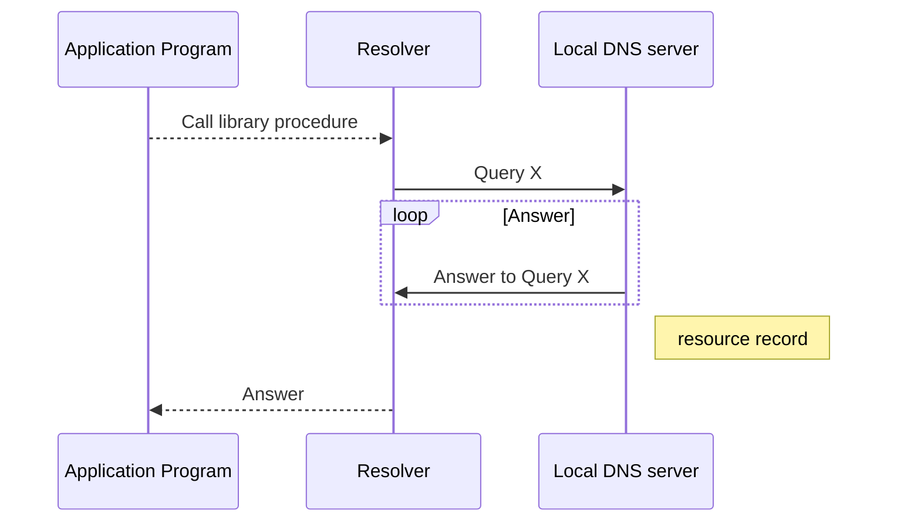

<!--more-->

---

# DNS

## Intro

To map a name onto an IP address, an application program calls a library procedure called the resolver, passing the name as a parameter.
The resolver sends a query containing the name to a local DNS server, which looks up the name and returns a response containing the IP address to the resolver, which then returns it to the caller. The query and response messages are sent over UDP if the query is local or TCP if external.
### DNS Operation diagram

[standard DNS query](https://www.cloudshark.org/captures/13833cdd14ba)

## Modify host file

This will add a static DNS entry locally on the machine.

#### [Windows](https://gist.github.com/zenorocha/18b10a14b2deb214dc4ce43a2d2e2992)

#### Linux

Add static entries to /etc/hosts 

eg:

64.49.219.194 www.domain.com

## Namespace

The top naming hierarchy is managed by [ICANN](https://www.icann.org), conceptually the internet is dividedS in over 250 top level domains (TLDs)

Each domain is partitioned in subdomains and these are each partitioned into further subdomains, and so on.

Space | Use |
--------|------|
Root|The root domain is usually indicated by a dot ".", it indicates the top of DNS hierarchy|
Top-level domain|Maintained by [IANA](https://www.iana.org), they can be countries or generic dg com org gov|
Second-level domain|eg [cisco](https://www.cisco.com), [prosperon](https://www.prosperon.co.uk), [insight](https://www.insight.com)|
Subdomains|Any domain within the second level domain|
Resource Name|The hostname of the resource eg www|

    
        Part of the DNS name space. 
    

Domain names 
- Domain names are case-insensitive
- Component names can be up to 63 characters long and full path names can't exceed 255 characters
- Components are separated by periods "." and the absolute path begins with root eg host.sitio.com. equates to the unix path /com/sitio/host

## Resource Records

Resource Records (RR) are entries in a DNS database

The primary function of DNS is to map domain names onto resource records.

For a single host, the most common resource record is just its IP address, but there are other kinds of resource records

### Resource Record structure:

field | description |
--------|------|
Domain-name|domain to which this record applies|
TTL|how stable the record is in seconds|
Class|Internet Information (IN) in almost most cases|
Type|what kind of record this is|
Value|can be a number, a domain name, or an ASCII string|

### Resource Record types:

Type | Meaning | Value
--------|------|------|
SOA | Start of authority | Parameters for this zone
A | IPv4 address of a host | 32-Bit integer
AAAA | IPv6 address of a host | 128-Bit integer
MX | Mail exchange | Priority, domain willing to accept email
NS | Name server | Name of a server for this domain
CNAME | Canonical name | Domain name
PTR | Pointer | Alias for an IP address
SPF | Sender policy framework | Text encoding of mail sending policy
SRV | Service | Host that provides it
TXT | Text | Descriptive ASCII text

## Examples

When you own a domain name, in my case **sitio.co.uk**, the type A record on the Resource Record for this domain can be set to your public IP Address.

So that queries made for the sitio.co.uk domain name return my public IP to the resolver, and access to the service I'm providing at that address.

eg

PS DNS template:

This powershell template will call on different record types on a number of famous sites.

    clear DnsClientCache;
    nslookup www.google.com;
    nslookup -type=A www.microsoft.com;
    nslookup -type=AAAA www.cisco.com;
    nslookup -type=NS www.cbtnuggets.com;
    nslookup -type=PRT 8.8.8.8;
    nslookup -type=MX google.com;
    nslookup -type=SRV _ldap._tcp.dc._msdcs.nuggetlab.com;
    nslookup -type=SOA amazon.com;
    nslookup -type=TXT insight.com;
    Resolve-DnsName www.cisco.com;
    Resolve-DnsName www.prosperon.co.uk;
    

    $dnscheck | Out-File -append <path>