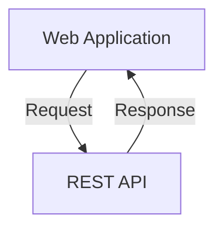

<!--more-->

---

# APIs and REST

## Application Programming Interface (API)

*A server that you can use to retrieve and send data using code.*

It enables two pieces of software to communicate with each other, and its most commonly used to retrieve data.

Just like other network services, the API listens on a given port and [URI](https://en.wikipedia.org/wiki/Uniform_Resource_Identifier). To which you target your requests.


<center></center>
<div style="text-align: center;">
    <span style="font-size:11px; color:grey">
        URI syntax diagram 
    </span>
</div>

### Definition of Interface:

A shared boundary across which two or more separated components of a computer system exchange information.

## REpresentational State Transfer (REST)

REST is a framework... an API framework. REST APIs involve requests and responses over the HTTP protocol.



<!---->

#### "RESTful" design pros
- Meets performance needs
- Scales well
- Simple to write and use
- reliable


*A web service is a defined interface that two systems can use to communicate*

### Example URI from the Google Maps API:

	http://maps.googleapis.com/maps/api/geocode/json?address=sanjose

<center></center>

Part | Value | Description
--------|------|------|
Protocol | http:// or https:// | Indicates if the server host is open or secured
Domain-Name | maps.googleapis.com | Domain name of the target host
Resource Path | /maps/api/geocode/json | Resource path of the API call
Parameter | ?address=sanjose | Details for the service to filter, scope, or paginate the response data.

### HTTP methods

*REST design centers around the HTTP request and response model.*

[HTTP request methods](https://developer.mozilla.org/en-US/docs/Web/HTTP/Methods)

Enter [Create Read Update Delete (CRUD)](https://en.wikipedia.org/wiki/Create,_read,_update_and_delete), the four basic functions of persistent storage.

Operation | SQL | HTTP verb | RESTful |
--------|------|------|------|
Create | INSERT| PUT / POST | POST |
Read (Retrieve) | SELECT | GET | GET |
Update (Modify) | UPDATE | PUT / POST / PATCH | PUT |
Delete (Destroy) | DELETE | DELETE | DELETE |

### Response status codes

<center></center>

When a request that contains a correct URI and verb, the service returns a status code.

A valid REST API request typically gets a **200 OK** response, this indicates that the API received and understood the request.

An invalid request might come back as **404 Not Found**

#### List of common REST API status

Status Code | Message| Meaning
--------|------|------|
[200](https://developer.mozilla.org/en-US/docs/Web/HTTP/Status/200) | OK | Received and understood
[201](https://developer.mozilla.org/en-US/docs/Web/HTTP/Status/201) | Created | New resource created
[400](https://developer.mozilla.org/en-US/docs/Web/HTTP/Status/400) | Bad Request | Request was invalid
[401](https://developer.mozilla.org/en-US/docs/Web/HTTP/Status/401) | Unauthorized | Authentication missing or incorrect
[403](https://developer.mozilla.org/en-US/docs/Web/HTTP/Status/403) | Forbidden | Understood but not allowed
[404](https://developer.mozilla.org/en-US/docs/Web/HTTP/Status/404) | Not Found | Resource not found
[500](https://developer.mozilla.org/en-US/docs/Web/HTTP/Status/500) | Internal Server Error | Something wrong with the server
[503](https://developer.mozilla.org/en-US/docs/Web/HTTP/Status/503) | Service Unavailable | Server is unable to complete request

### REST API Headers

Requests and responses can use *headers* to pass info to or from the service.

These headers can carry metadata to help define request or response.

Header | eg | Purpose
-------|----|---------
Content-Type | Application/json | specify format of data in body
Accept | Application/json | specify requested format for returned data, in this case json
Authorization | Bearer DDuiDIOnwai41z | provide credentials, in this example a generated token
Date/Time Stamp | Wen Sep, 18 07:49 BST 2019 | Date and time for request or response message

## REST Payloads

"The body of the request may contain a *Payload* that carries data to or from the service".

Two formats are most common for the REST framework are:

[JavaScript Object Notation](http://www.json.org) (**JSON**). A text based standard designed to be human readable.

#### Example of JSON object:

```JSON
{
  "iface type": "GigabitEthernet",
  "iface number": "2/0/12"
}
```

And the Extensible Markup Language(**XML**). Designed to store and transport data.

#### Example of an XML snippet:

```XML
<interfaces xmlns="urn:ietf:params:xml:ns:yang:ietf-interfaces">
    <interface>
        <name>GigabitEthernet1</name>
        <type xmlns:ianaift="urn:ietf:params:xml:ns:yang:iana-if-type">ianaift:ethernetCsmacd</type>
        <enabled>true</enabled>
        <ipv4 xmlns="urn:ietf:params:xml:ns:yang:ietf-ip">
            <address>
                <ip>198.18.133.212</ip>
                <netmask>255.255.192.0</netmask>
            </address>
        </ipv4>
        <ipv6 xmlns="urn:ietf:params:xml:ns:yang:ietf-ip"/>
    </interface>
    ...
</interfaces>

```


**Note:** You can find out what the REST payload format is by looking at the "Content-Type REST header"